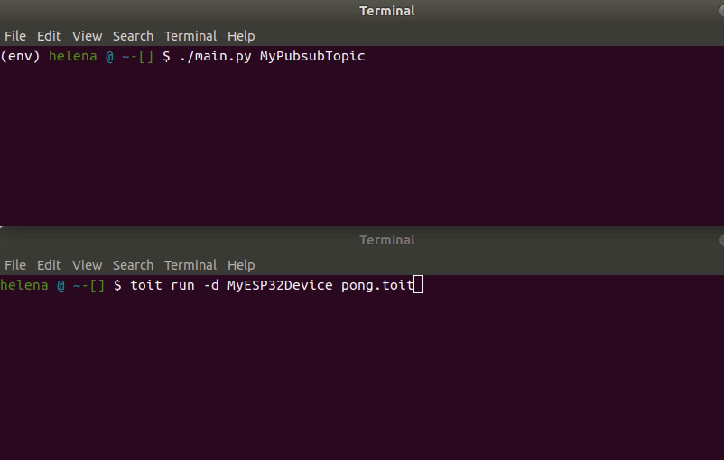

# PubSub ping pong

The application will send messages on the topic `cloud:demo/ping` and print all message received on the topic `cloud:demo/pong`.

Use the `pong.toit` program to send replies back.

## Installation

First, install `pyhton3` and `pip3`, and then install `virtualenv`:

    pip3 install virtualenv

Then, setup and activate `virtualenv` for your project:

    virtualenv -p python3 env
    source env/bin/activate

Next install dependencies:
```
$ pip install -r requirements.txt
```

## Setup

In order to subscribe to a PubSub topic using the Toit API a subscription is needed.
The application will subscribe to `cloud:demo/pong` so we have to create a subscription for this:

```
$ toit pubsub subscription create cloud:demo/pong <subscription-name>
```

Example:

```
$ toit pubsub subscription create cloud:demo/pong MyPubsubTopic
```

## API key

Create a new API key for your Toit project, by executing the Toit CLI command:

```
$ toit project api-keys add <name-of-key>
```

Example:

```
$ toit project api-keys add MyAPIKey
```

View the list of API keys available in your project with the Toit CLI command:

```
$ toit project api-keys list
```

Note the ID of your API key.

View the generated API key *secret* with the Toit CLI command:

```
$ toit project api-keys print-secret <api-key-id>
```


## Run

Run the application with your the chosen subscription-name:

```
$ ./main.py <subscription-name>
```

Example:

```
$ ./main.py MyPubsubTopic
```

The program will prompt for the API key *secret* as input.

While the python application is running in one terminal window, run the toit application in another:

```
$ toit run -d <your-device> pong.toit
```

Example:

```
$ toit run -d MyESP32Device pong.toit
```


